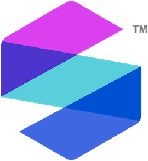

<!-- README.md is generated from README.Rmd. Please edit that file -->


```{r setup, include = FALSE}
Sys.setlocale("LC_COLLATE", "en_US.UTF-8") # ensure common sorting envir
knitr::opts_chunk$set(
  collapse = TRUE,
  comment = "#>",
  fig.path = "man/figures/README-"
)
ver <- desc::desc_get_version(".")
ver <- paste0("https://img.shields.io/badge/Version-", ver,
              "-success.svg?style=flat&logo=github")
```


# SomaScan.db <a href="https://somalogic.github.io/SomaDataIO"></a>


The `SomaScan.db` package is a platform-centric R package that provides 
extended biological annotations for analytes in the SomaScan assay menu, using 
resources provided by the [Bioconductor project](https://bioconductor.org/). 
The package exposes a single object, `SomaScan.db`, which is an SQLite 
database that can be queried to retrieve annotations for SomaScan analytes. 

`SomaScan.db` is structured around a primary identifier, the SomaLogic 
sequence ID (`SeqId`), which is in the format `12345-67`. In this package, the 
`SeqId` may also be referred to as the "PROBEID". This identifier is the 
cornerstone of the SomaScan assay, and is used to uniquely identify SomaLogic 
analytes. For more information about `SeqIds`, please see
[?SomaDataIO::SeqId](https://somalogic.github.io/SomaDataIO/reference/SeqId.html)

The `SomaScan.db` package enables mapping from `SeqIds` to other identifiers 
from popular public data repositories, many of which are gene-based, and vice 
versa. See below for installation instructions and usage examples.

---------------------


## Installation

The development version of the `SomaScan.db` package can be be installed 
from GitHub:

```{r eval=FALSE}
remotes::install_github("SomaLogic/SomaScan.db")
```

The package can then be loaded using the usual syntax:

```{r eval=FALSE}
library(SomaScan.db)
```


### Dependencies

The `SomaScan.db` package requires `R >= 4.2.0`, and depends on the 
following R packages:

* `methods` 
    - comes bundled with R installation
* `DBI`
    - install from CRAN: `install.packages("DBI")`
* `AnnotationDbi` (>= 1.56.2)
    - install from Bioconductor: `BiocManager::install("AnnotationDbi")`
* `org.Hs.eg.db` (>= 3.14.0)
    - install from Bioconductor: `BiocManager::install("org.Hs.eg.db")`

You may also want to install another of SomaLogic's R packages,
[SomaDataIO](https://github.com/SomaLogic/SomaDataIO/),
which is designed for reading, writing, and manipulating
[ADATs](https://github.com/SomaLogic/SomaLogic-Data/blob/master/README.md).
If you have not already used `SomaDataIO` to work with your 
SomaScan data, you will likely find it highly useful. `SomaDataIO` is 
available on [CRAN](https://cran.r-project.org/package=SomaDataIO).

---------------------


## Usage

The annotations in `SomaScan.db` can be queried using 5 methods that are 
common amongst Bioconductor annotation packages:

1. `keys` returns a list of all central identifiers in the package, aka 
SomaScan analytes, for which there are annotations available:
  
```{r eval=FALSE}
keys(SomaScan.db)
```

2. `keytypes` lists data types that can be used as keys to query the 
SQLite database:

```{r eval=FALSE}
keytypes(SomaScan.db)
```

3. `columns` lists all available data types:

```{r eval=FALSE}
columns(SomaScan.db)
```

4. `mapIds` retrieves annotation data (from only a single data type, aka 
column):

```{r eval=FALSE}
mapIds(SomaScan.db, keys = "18342-2", columns = "SYMBOL", multiVals = "first")
```

5. `select` retrieves annotation data en masse (from multiple columns) using 
values from `keys` and `columns`:

```{r eval=FALSE}
select(SomaScan.db, keys = "18342-2", columns = c("ENTREZID", "SYMBOL", "UNIPROT"))
```

`select` can also be used to identify `SeqIds` associated with a gene or
or protein of interest (here, `PROBEID` refers to the SomaScan `SeqIds`):

```{r eval=FALSE}
select(SomaScan.db, keys = "EGFR", keytype = "SYMBOL", columns = "PROBEID")
```


For more detailed usage examples, please see the `SomaScan.db` package 
vignettes, or the introductory vignette from Bioconductor's `AnnotationDbi`:

```{r}
vignette("IntroToAnnotationPackages", package = "AnnotationDbi")
```


---------------------


## SomaScan Menus

The SomaScan menu version will be referenced at various points throughout this 
package and its documentation. Please see the table below for information 
about each menu:

| SomaScan version     | Common name    | Plex size[^1]  |
| :------------------- | :------------- | :------------- |
| v4.0                 | 5k             | 5,284          |
| v4.1                 | 7k             | 7,596          |

[^1]: `SomaScan.db` contains annotations for human protein targets only. 
However, some targets in the SomaScan menu are associated with biological 
entities not represented in this package. As such, this value may differ from 
the exact number in your ADAT. 

---------------------


## MIT LICENSE

`SomaScan.db` is licensed under the MIT license and is intended
solely for research use only (RUO) purposes. The code contained
herein may not be used for diagnostic, clinical, therapeutic, or other
commercial purposes.

- See:
  - [LICENSE](https://github.com/SomaLogic/SomaScan.db/blob/main/LICENSE.md)
- The MIT license:
  - <https://choosealicense.com/licenses/mit/>
  - [https://www.tldrlegal.com/license/mit-license/](https://www.tldrlegal.com/license/mit-license)
- Further:
  - "SomaScan.db" and "SomaLogic" are trademarks owned by SomaLogic
    Operating Co., Inc. No license is hereby granted to these trademarks
    other than for purposes of identifying the origin or source of this
    Software
