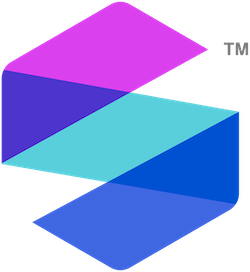

<!-- README.md is generated from README.Rmd. Please edit that file -->

# `SomaScan.db` 

<!-- badges: start -->


[](https://lifecycle.r-lib.org/articles/stages.html#stable)
[](https://choosealicense.com/licenses/mit/)
[](https://bioconductor.org/packages/stats/data-annotation/SomaScan.db/)
[](https://support.bioconductor.org/tag/SomaScan.db)
<!-- badges: end -->

# Oveview

The `SomaScan.db` package is a platform-centric R package that provides
extended biological annotations for analytes in the SomaScan assay menu,
using resources provided by the
[Bioconductor](https://bioconductor.org/) project. The package exposes a
database object, `SomaScan.db`, which is an SQLite database that can be
queried to retrieve annotations for SomaScan analytes.

`SomaScan.db` is structured around a primary identifier, the SomaLogic
sequence ID (`SeqId`). Please note that in some cases, this identifier
may also be referred to as a “PROBEID”. `SeqIds` are the cornerstone of
the SomaScan assay, and are used to uniquely identify SomaLogic
analytes. The `SomaScan.db` package enables mapping from `SeqIds` to
other identifiers from popular public data repositories, many of which
are gene-based, and vice versa.

For more information about `SeqIds`, please see
[?SomaDataIO::SeqId](https://somalogic.github.io/SomaDataIO/reference/SeqId.html).

------------------------------------------------------------------------

## Installation

`SomaScan.db` can be installed from the most recent Bioconductor release
using the [BiocManager](https://CRAN.R-project.org/package=BiocManager)
package:

``` r
# If not already installed, install BiocManager
if (!require("BiocManager", quietly = TRUE)) {
    install.packages("BiocManager")
}

BiocManager::install("SomaScan.db")
```

The development version of `SomaScan.db`, containing the most current
features and/or updates, can be be installed from GitHub:

``` r
remotes::install_github("SomaLogic/SomaScan.db")
```

Once installed, the package can be loaded using the usual syntax:

``` r
library(SomaScan.db)
```

### Dependencies

The `SomaScan.db` package requires `R >= 4.3.0`, and depends on the
following R packages:

- `methods`
  - comes bundled with R installation
- `AnnotationDbi` (\>= 1.56.2)
  - install from Bioconductor: `BiocManager::install("AnnotationDbi")`

You may also want to install another of SomaLogic’s R packages,
[SomaDataIO](https://github.com/SomaLogic/SomaDataIO/), which is
designed for reading, writing, and manipulating
[ADATs](https://github.com/SomaLogic/SomaLogic-Data/blob/master/README.md).
If you have not already used `SomaDataIO` to work with your SomaScan
data, you will likely find it highly useful. `SomaDataIO` is available
on [CRAN](https://cran.r-project.org/package=SomaDataIO).

------------------------------------------------------------------------

## Usage

The annotations in `SomaScan.db` can be queried using 5 methods that are
common amongst Bioconductor annotation packages:

1.  `keys` returns a list of all central identifiers in the package, aka
    SomaScan analytes, for which there are annotations available:

``` r
keys(SomaScan.db)
```

2.  `keytypes` lists data types that can be used as keys to query the
    SQLite database:

``` r
keytypes(SomaScan.db)
```

3.  `columns` lists all available data types:

``` r
columns(SomaScan.db)
```

4.  `mapIds` retrieves annotation data (from only a single data type,
    aka column):

``` r
mapIds(SomaScan.db, keys = "18342-2", columns = "SYMBOL", multiVals = "first")
```

5.  `select` retrieves annotation data en masse (from multiple columns)
    using values from `keys` and `columns`:

``` r
select(SomaScan.db, keys = "18342-2", columns = c("SYMBOL", "UNIPROT"))
```

`select` can also be used to identify `SeqIds` associated with a gene or
or protein of interest (here, `PROBEID` refers to the SomaScan
`SeqIds`):

``` r
select(SomaScan.db, keys = "EGFR", keytype = "SYMBOL", columns = "PROBEID")
```

For more detailed usage examples, please see the `SomaScan.db` package
vignettes, or the introductory vignette from Bioconductor’s
`AnnotationDbi`:

``` r
vignette("IntroToAnnotationPackages", package = "AnnotationDbi")
```

------------------------------------------------------------------------

## SomaScan Menus

The SomaScan menu version will be referenced at various points
throughout this package and its documentation. Please see the table
below for information about each menu:

| SomaScan version | Common name | Plex size[^1] |
|:-----------------|:------------|:--------------|
| v4.0             | 5k          | 5,284         |
| v4.1             | 7k          | 7,596         |

------------------------------------------------------------------------

## MIT LICENSE

`SomaScan.db` is licensed under the MIT license and is intended solely
for research use only (RUO) purposes. The code contained herein may not
be used for diagnostic, clinical, therapeutic, or other commercial
purposes.

- See:
  - [LICENSE](https://github.com/SomaLogic/SomaScan.db/blob/main/LICENSE.md)
- The MIT license:
  - <https://choosealicense.com/licenses/mit/>
  - [https://www.tldrlegal.com/license/mit-license/](https://www.tldrlegal.com/license/mit-license)
- Further:
  - “SomaScan.db” and “SomaLogic” are trademarks owned by SomaLogic
    Operating Co., Inc. No license is hereby granted to these trademarks
    other than for purposes of identifying the origin or source of this
    Software

[^1]: `SomaScan.db` contains annotations for human protein targets only.
    However, some targets in the SomaScan menu are associated with
    biological entities not represented in this package. As such, this
    value may differ from the exact number in your ADAT.
